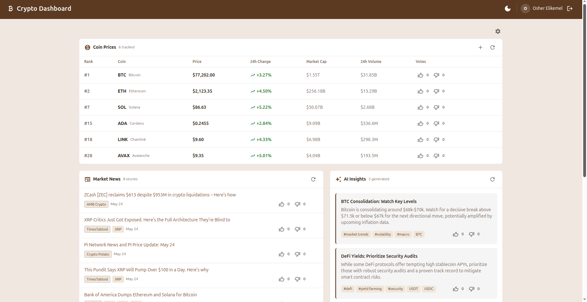
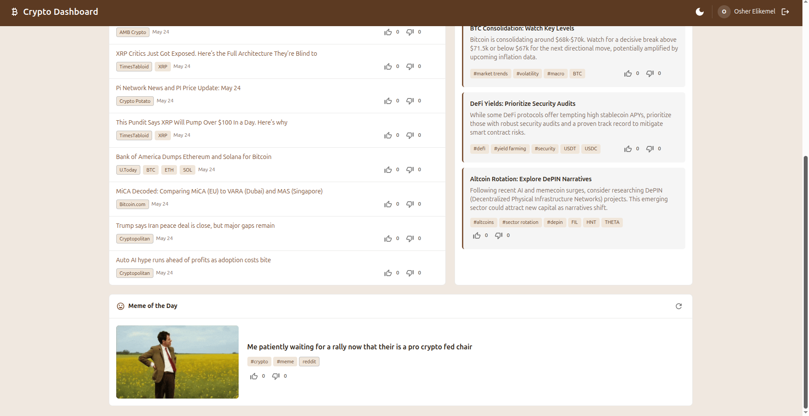
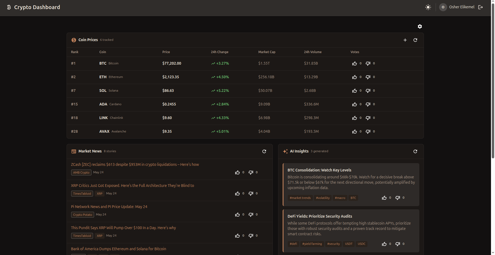
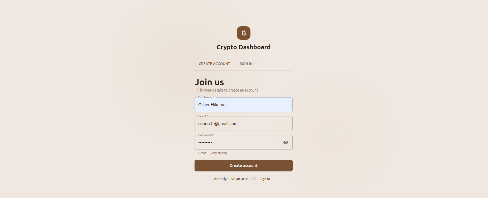
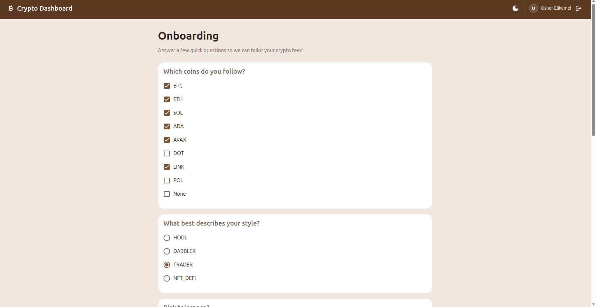
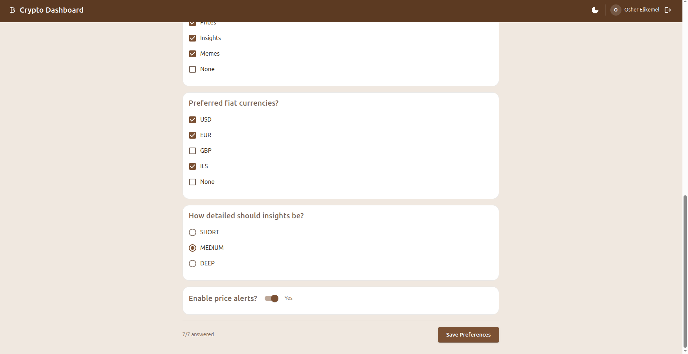
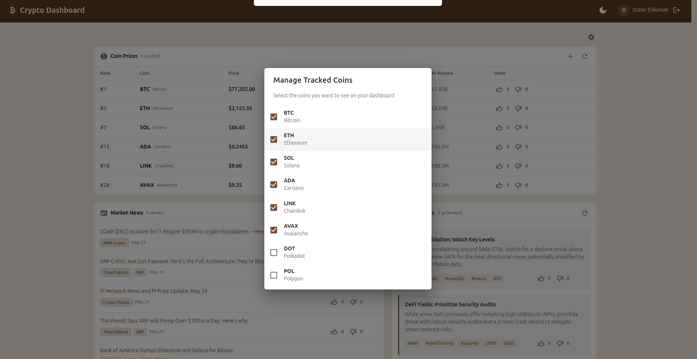

# AI Crypto Dashboard

A full-stack crypto advisor dashboard that aggregates live coin prices, market news, AI-generated insights, and community memes. Features quiz-based onboarding that personalizes your feed and AI insights, a voting system across all content types, and per-user dashboard customization. Built with React 19, Express 5, MongoDB, and Docker.



<details>
<summary>More screenshots</summary>

### Dashboard (continued)


### Dashboard, Dark Mode


### Registration


### Onboarding Quiz


### Onboarding Quiz (continued)


### Coin Management


</details>

## Features

- **Quiz Onboarding** — New users answer questions about investor type, preferred coins, risk level, and content preferences. The dashboard and AI insights adapt to their answers.
- **Live Coin Prices** — Real-time prices, 24h change, market cap, volume, and rank from CoinGecko
- **Personalized Dashboard** — Users control which coins and sections appear. Add/remove coins with a "+" button; toggle entire sections (Prices, News, Insights, Memes) via the settings gear
- **Market News** — Live crypto news from CoinDesk Data API (free, no API key required). 50 articles fetched per batch, displayed 8 at a time with pagination on refresh
- **AI Insights** — Personalized market tips generated by Google Gemini 2.5 Flash (free tier). Insights are tailored to the user's coins, investor type, risk tolerance, and preferred depth
- **Crypto Memes** — Community memes from Reddit (no API key required)
- **Voting System** — Like/dislike content across all sections. Vote status persists across page reloads
- **Dark / Light Mode** — Theme toggle with localStorage persistence
- **Auto-Seed** — Database auto-populates with coins and quiz questions on first startup. Real content (news, insights, memes) is fetched from live APIs — no placeholder data
- **Stale Data Cleanup** — On startup, insights older than 24h, memes older than 24h, and news older than 7 days are automatically cleaned up before fetching fresh content
- **JWT Authentication** — Registration, login, and protected routes
- **Secure API** — Refresh endpoints require authentication; content responses return vote counts instead of leaking user IDs

## Tech Stack

| Layer | Technology | Purpose |
|-------|-----------|---------|
| Frontend | React 19 + TypeScript | UI with strict typing |
| Build | Vite 7 | Dev server + production builds |
| UI Library | Material UI (MUI) 7 | Component library with custom theme |
| HTTP Client | Axios | Interceptors, centralized error handling |
| Routing | React Router DOM 7 | Route guards for auth and onboarding |
| Backend | Express 5 (Node.js) | REST API server |
| Database | MongoDB 7 + Mongoose 8 | Document storage with ODM |
| Auth | JWT + bcrypt | Token-based authentication |
| Infrastructure | Docker + Docker Compose | One-command local setup |
| External APIs | CoinGecko, CoinDesk, Google Gemini, Reddit | Market data, news, AI insights, memes |

## Quick Start

### Prerequisites
- Docker and Docker Compose installed

### 1. Clone the repository
```bash
git clone https://github.com/OsherElikamel/ai-crypto-dashboard.git
cd ai-crypto-dashboard
```

### 2. Configure environment variables
```bash
cp backend/.env.example backend/.env
```

The app works out of the box with coin prices, news, and memes (CoinGecko, CoinDesk, and Reddit public APIs — no keys needed). For AI-generated insights, add a free Gemini API key to `backend/.env` — see [Environment Variables](#environment-variables).

### 3. Start with Docker Compose
```bash
docker compose up --build
```

On first startup, the backend seeds the database with coins and quiz questions, then fetches live data from all APIs: prices from CoinGecko, news from CoinDesk, insights from Gemini, and a meme from Reddit.

### 4. Open the app
| Service | URL |
|---------|-----|
| Frontend | http://localhost:5173 |
| Backend API | http://localhost:8080 |
| Mongo Express (DB UI) | http://localhost:8081 |

### 5. Register and explore
Create an account, complete the onboarding quiz, and your dashboard will be personalized based on your answers. Use the settings gear to toggle sections and the "+" button on Coin Prices to manage tracked coins.

## API Endpoints

### Auth
| Method | Endpoint | Description | Auth |
|--------|----------|-------------|------|
| POST | /auth/register | Create a new account | No |
| POST | /auth/login | Sign in | No |
| GET | /auth/me | Get current user | Yes |
| PATCH | /auth/preferences | Update user preferences (coins, sections) | Yes |

### Content
| Method | Endpoint | Description | Auth |
|--------|----------|-------------|------|
| GET | /coins | List coins (paginated, filterable by `?symbols=`) | Optional* |
| GET | /coins/:id | Get coin by ID | Optional* |
| GET | /insights | List AI insights | Optional* |
| GET | /insights/:id | Get insight by ID | Optional* |
| GET | /news | List news articles | Optional* |
| GET | /news/:id | Get news item by ID | Optional* |
| GET | /memes | List memes | Optional* |
| GET | /memes/:id | Get meme by ID | Optional* |

*\*Optional auth: if a Bearer token is provided, responses include the user's `voteStatus` for each item.*

### Refresh (External Providers)
| Method | Endpoint | Description | Auth |
|--------|----------|-------------|------|
| POST | /api/prices/refresh | Refresh all coin prices from CoinGecko | Yes |
| POST | /api/meme/refresh | Fetch and store a new random meme | Yes |
| POST | /api/news/refresh | Fetch 50 articles from CoinDesk | Yes |
| POST | /api/insights/refresh | Generate 3 personalized insights from Gemini | Yes |

### Quiz
| Method | Endpoint | Description | Auth |
|--------|----------|-------------|------|
| GET | /quiz/questions | Get onboarding quiz questions | Yes |
| POST | /quiz/answers | Submit quiz answers | Yes |

### Voting
| Method | Endpoint | Description | Auth |
|--------|----------|-------------|------|
| POST | /vote/:type/:id | Vote on content (like/dislike/clear) | Yes |

## Environment Variables

### Backend (`backend/.env`)
| Variable | Description | Required |
|----------|-------------|----------|
| `PORT` | Server port (default: 8080) | No |
| `ORIGIN` | CORS allowed origin | No |
| `MONGODB_URI` | MongoDB connection string | No (set by Docker Compose) |
| `JWT_SECRET` | Secret for signing JWT tokens | Yes |
| `JWT_EXPIRES_IN` | Token expiry duration (default: `7d`) | No |
| `CG_API_KEY` | CoinGecko demo API key (increases rate limits) | No |
| `GEMINI_KEY` | Google Gemini API key (enables AI insights) | No |

### Frontend (`frontend/.env`)
| Variable | Description | Required |
|----------|-------------|----------|
| `VITE_SERVER_URL` | Backend API URL | No (set by Docker Compose) |

### What works without API keys
- **Coin prices** — CoinGecko public API (rate-limited but functional)
- **News** — CoinDesk Data API (free, no key required)
- **Memes** — Reddit public JSON API (no auth needed)
- **Voting, quiz, preferences** — all local, no external APIs

### What needs an API key
- **AI Insights** — requires `GEMINI_KEY` ([get a free key here](https://aistudio.google.com/apikey)) — free tier supports 1,500 requests/day

## Project Structure

```
ai-crypto-dashboard/
├── backend/
│   ├── src/
│   │   ├── controllers/        # Request handlers (auth, coins, insights, news, memes, quiz, vote)
│   │   ├── middleware/         # JWT auth (required + optional), global error handler
│   │   ├── models/            # Mongoose schemas (User, Coin, Insight, NewsItem, Meme, Questions)
│   │   ├── routes/            # Express routers (auth, content, api, quiz, vote)
│   │   ├── services/          # External API integrations (CoinGecko, CoinDesk, Gemini, Reddit)
│   │   ├── utils/             # Shared utilities (sanitize — strips voter IDs, adds counts + vote status)
│   │   ├── config.js          # Centralized environment variable reading
│   │   ├── db.js              # MongoDB connection
│   │   ├── index.js           # Express app entry point + startup data refresh + stale cleanup
│   │   └── seed.js            # Auto-seed module (coins + quiz questions only)
│   ├── .env.example
│   ├── Dockerfile
│   └── package.json
├── frontend/
│   ├── src/
│   │   ├── components/
│   │   │   ├── dashboard/     # CoinsSection, NewsSection, InsightsSection, MemeSection, AddCoinDialog, SectionSettingsDialog
│   │   │   ├── layout/        # AppShell (AppBar + theme toggle + Outlet)
│   │   │   └── ui/            # VoteButtons (reads voteStatus from item)
│   │   ├── contexts/          # AuthContext (JWT + user state), ThemeContext (dark/light)
│   │   ├── hooks/             # useDashboardData (data fetching, state, handlers for dashboard)
│   │   ├── pages/             # AuthPage, OnboardingPage, DashboardPage
│   │   ├── routes/            # Route definitions + guards (GuestRoute, OnboardedRoute, NotOnboardedRoute)
│   │   ├── services/          # API calls (auth.service, dashboard.service, quiz.service)
│   │   ├── types/             # TypeScript interfaces (Coin, Insight, NewsItem, Meme, User)
│   │   ├── utils/             # Axios client (api.ts), input validation
│   │   ├── App.tsx            # Root component
│   │   └── main.tsx           # React entry point
│   ├── Dockerfile
│   └── package.json
├── docker-compose.yml
├── LICENSE
└── README.md
```

## License

MIT
